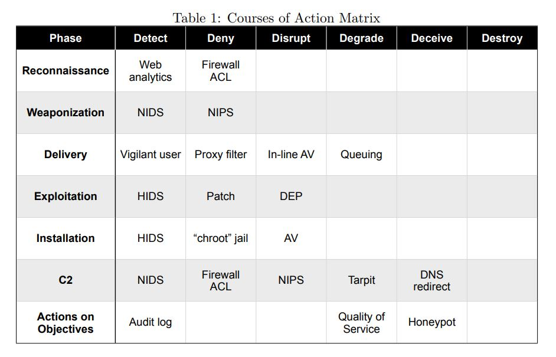
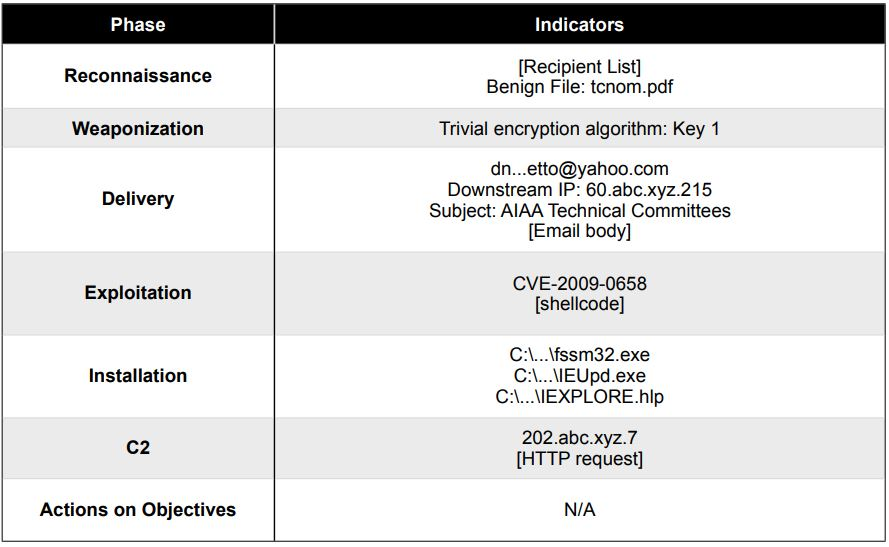
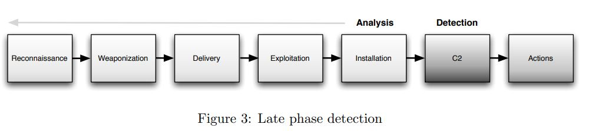
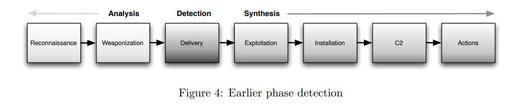

# InfoSec_h1
h1 First steps
Become a hacker, step 0

x) Read and summarize. (This subtask x does not require tests with a computer. Some bullets per article is enough for your summary)
Hutchins et al 2011: Intelligence-Driven Computer Network Defense Informed by Analysis of Adversary Campaigns and Intrusion Kill Chains, chapters Abstract, 3.2 Intrusion Kill Chain and 3.3 Courses of Action

## Indicators and the Indicator Life Cycle

* Atomic - Atomic indicators are those which cannot be broken down into smaller parts and retain
their meaning in the context of an intrusion

* Computed - Computed indicators are those which are derived from data involved in an incident.

* Behavioral - Behavioral indicators are collections of computed and atomic indicators, often subject
to qualification by quantity and possibly combinatorial logic.

## Intrusion Kill Chain

1. Reconnaissance - Research, identification and selection of targets, often represented as crawling
Internet websites such as conference proceedings and mailing lists for email addresses, social
relationships, or information on specific technologies.

2. Weaponization - Coupling a remote access trojan with an exploit into a deliverable payload,
typically by means of an automated tool (weaponizer).

3. Delivery - Transmission of the weapon to the targeted environment.

4. Exploitation - After the weapon is delivered to victim host, exploitation triggers intruders’ code.

5. Installation - Installation of a remote access trojan or backdoor on the victim system allows the
adversary to maintain persistence inside the environment.

6. Command and Control (C2) - Typically, compromised hosts must beacon outbound to an
Internet controller server to establish a C2 channel.

7. Actions on Objectives - Only now, after progressing through the first six phases, can intruders
take actions to achieve their original objectives.

### Courses of Action Matrix

The kill chain shows an asymmetry between aggressor and defender, any one repeated component by
the aggressor is a liability. Understanding the nature of repetition for given adversaries, be it out of
convenience, personal preference, or ignorance, is an analysis of cost. Modeling the cost-benefit ratio
to intruders is an area for additional research. When that cost-benefit is decidedly imbalanced, it is
perhaps an indicator of information superiority of one group over the other. Models of information
superiority may be valuable for computer network attack and exploitation doctrine development. Finally,
this paper presents an intrusions kill chain model in the context of computer espionage. Intrusions may
represent a broader problem class.

Karvinen 2020: Command Line Basics Revisited

+ Moving and looking around

(print working directory)
        
        $ pwd
        
(list files in working directory)        
        
        $ ls
        
(change directory)        
        
        $ cd
        $ cd ..
        
(piping the output from etc to less)        
        
        $ ls /etc|less
        
+ File Manipulation
 
 (view/edit file)
 
        $ nano ***.txt
        $ vim ***.txt
        $ vi ***.txt
        
 (make new directory)
 
        $ mkdir
        
 (move or rename directory)
 
        $ mv 
        
 (copy, -r recursive)
 
        $ cp 
        $ cp -r
        
 (remove direcrory)
 
        $ rmdir
 
 (remove file)
 
        $ rm 
        $ rm -r
        
+ SSH Remote Control 
 
        $ ssh user@example.com
        
 (exit)
 
        remotecomputer$ exit
   
 (copy with ssh)
 
        $ scp -r FOLDER user@example.com:public_html/
        
        
a) Bandit oh-five. Solve Over The Wire: Bandit the first five levels (0-4).

### 0 -> 1
 
bandit0@bandit:~$ pwd

/home/bandit0

bandit0@bandit:~$ ls

readme

bandit0@bandit:~$ cat readme

boJ9jbbUNNfktd78OOpsqOltutMc3MY1

### 1 -> 2

bandit1@bandit:~$ pwd

/home/bandit1

bandit1@bandit:~$ ls -lah

total 24K

-rw-r-----   1 bandit2 bandit1   33 Nov 14  2014 -

drwxr-xr-x   2 root    root    4.0K Nov 14  2014 .

drwxr-xr-x 172 root    root    4.0K Jul 10 14:12 ..

-rw-r--r--   1 root    root     220 Apr  9  2014 .bash_logout

-rw-r--r--   1 root    root    3.6K Apr  9  2014 .bashrc

-rw-r--r--   1 root    root     675 Apr  9  2014 .profile

bandit1@bandit:~$ cat ./-

CV1DtqXWVFXTvM2F0k09SHz0YwRINYA9

### 2 -> 3

bandit2@bandit:~$ pwd

/home/bandit2

bandit2@bandit:~$ ls -lah

total 24K

drwxr-xr-x   2 root    root    4.0K Nov 14  2014 .

drwxr-xr-x 172 root    root    4.0K Jul 10 14:12 ..

-rw-r--r--   1 root    root     220 Apr  9  2014 .bash_logout

-rw-r--r--   1 root    root    3.6K Apr  9  2014 .bashrc

-rw-r--r--   1 root    root     675 Apr  9  2014 .profile

-rw-r-----   1 bandit3 bandit2   33 Nov 14  2014 spaces in this filename

bandit2@bandit:~$ cat "spaces in this filename"

UmHadQclWmgdLOKQ3YNgjWxGoRMb5luK

### 3 -> 4

bandit3@bandit:~$ ls -aRl

.:

total 24

drwxr-xr-x   3 root root 4096 Nov 14  2014 .

drwxr-xr-x 172 root root 4096 Jul 10 14:12 ..

-rw-r--r--   1 root root  220 Apr  9  2014 .bash_logout

-rw-r--r--   1 root root 3637 Apr  9  2014 .bashrc

-rw-r--r--   1 root root  675 Apr  9  2014 .profile

drwxr-xr-x   2 root root 4096 Nov 14  2014 inhere

./inhere:

total 12

drwxr-xr-x 2 root    root    4096 Nov 14  2014 .

drwxr-xr-x 3 root    root    4096 Nov 14  2014 ..

-rw-r----- 1 bandit4 bandit3   33 Nov 14  2014 .hidden

bandit3@bandit:~$ cat ./inhere/.hidden

pIwrPrtPN36QITSp3EQaw936yaFoFgAB

b) Bullseye. Install Debian 11-Bullseye virtual machine in VirtualBox. (See also: Karvinen 2021: Install Debian on VirtualBox)

[Install Debian on Virtualbox](https://terokarvinen.com/2021/install-debian-on-virtualbox/)

1. Install VirtualBox
2. Create Virtual Machine
3. Create Virtual Hard Disk
4. Download Debian ISO file
5. Insert Debian ISO Image as a Virtual CDROM
6. Configure machine settings
7. Boot to Desktop - Choose to Live
8. Run the Installer
9. Fill all required fields
10. Use strong password
11. Login into the system
12. Upgrade system

                $ sudo apt-get -y dist-upgrade

Install a firewall and turn it on.
                        
                $ sudo apt-get -y install ufw
                $ sudo ufw enable
                
                
                
c) WebGoat. Install WebGoat practice target. (See also: Karvinen 2021: Install Webgoat 8 - Learn Web Pentesting)

## Install Webgoat 8 - Learn Web Pentesting

WebGoat is a beginner friendly practice target for web penetration testing.

Prerequisites

Install Java (and some helpful tools)

    $ sudo apt-get update
    $ sudo apt-get -y install openjdk-11-jre ufw wget bash-completion
    
Enable firewall.

    $ sudo ufw enable  
    
Install and Run WebGoat

Download and run Webgoat 8:

    $ wget https://terokarvinen.com/2020/install-webgoat-web-pentest-practice-target/webgoat-server-8.0.0.M26.jar
    $ java -jar webgoat-server-8.0.0.M26.jar

Register

write in the browser

    http://localhost:8080/WebGoat/
    
    

d) Hacker warmup. Solve these tasks on WebGoat

General: HTTP Basics

General: Developer tools

n) Voluntary bonus: Banditry. Solve Over the Wire: Bandit 5-7.

### 4 -> 5

bandit4@bandit:~$ ls -aRl

.:

total 24

drwxr-xr-x   3 root root 4096 Nov 14  2014 .

drwxr-xr-x 172 root root 4096 Jul 10 14:12 ..

-rw-r--r--   1 root root  220 Apr  9  2014 .bash_logout

-rw-r--r--   1 root root 3637 Apr  9  2014 .bashrc

-rw-r--r--   1 root root  675 Apr  9  2014 .profile

drwxr-xr-x   2 root root 4096 Oct 19 06:48 inhere

./inhere:

total 48

-rw-r----- 1 bandit5 bandit4   33 Nov 14  2014 -file00

-rw-r----- 1 bandit5 bandit4   33 Nov 14  2014 -file01

-rw-r----- 1 bandit5 bandit4   33 Nov 14  2014 -file02

-rw-r----- 1 bandit5 bandit4   33 Nov 14  2014 -file03

-rw-r----- 1 bandit5 bandit4   33 Nov 14  2014 -file04

-rw-r----- 1 bandit5 bandit4   33 Nov 14  2014 -file05

-rw-r----- 1 bandit5 bandit4   33 Nov 14  2014 -file06

-rw-r----- 1 bandit5 bandit4   33 Nov 14  2014 -file07

-rw-r----- 1 bandit5 bandit4   33 Nov 14  2014 -file08

-rw-r----- 1 bandit5 bandit4   33 Nov 14  2014 -file09

drwxr-xr-x 2 root    root    4096 Oct 19 06:48 .

drwxr-xr-x 3 root    root    4096 Nov 14  2014 ..

bandit4@bandit:~$ cat ./inhere/-f*

koReBOKuIDDepwhWk7jZC0RTdopnAYKh

### 5 -> 6

bandit5@bandit:~$ find ./inhere -size 1033c

./inhere/maybehere07/.file2

bandit5@bandit:~$ cat ./inhere/maybehere07/.file2

DXjZPULLxYr17uwoI01bNLQbtFemEgo7

### 6 -> 7

bandit6@bandit:~$ find / -size 33c -user bandit7 -group bandit6 2>/dev/null

/var/lib/dpkg/info/bandit7.password

bandit6@bandit:~$ cat /var/lib/dpkg/info/bandit7.password

HKBPTKQnIay4Fw76bEy8PVxKEDQRKTzs

### 7 -> 8

bandit7@bandit:/$ find / -type f -exec grep -l millionth {} + 2>dev/null

/proc/374/task/374/cmdline

/home/bandit7/data.txt

/usr/lib/perl/5.18.2/Time/HiRes.pm

/usr/share/dict/american-english

bandit7@bandit:/$ cat /home/bandit7/data.txt | grep millionth

millionth	cvX2JJa4CFALtqS87jk27qwqGhBM9plV

o) Voluntary bonus: My fundaments. What do you consider the fundamentals of security? What would you teach the first day?

1. I think it would be great to describe the history of cybersecurity. 
2. Why the cybersecurity is important. 
3. The CIA Triad. 
4. The different types of profession and careers in cybersecurity. 
5. Different types of cybersecurity operations:
   * Network security
   * Application security
   * Cloud security
   * Information security
   * Infrastructure security
   * Storage security
   * Mobile security
   * etc 

p) Voluntary bonus: Johnny Tables. Solve Webgoat: A1 Injection (intro).

q) Voluntary multi-week bonus, requires programming: Ptacek et al: Cryptopals.

Convert hex to base64 with Python3
The string:

        49276d206b696c6c696e6720796f757220627261696e206c696b65206120706f69736f6e6f7573206d757368726f6f6d

Should produce:

        SSdtIGtpbGxpbmcgeW91ciBicmFpbiBsaWtlIGEgcG9pc29ub3VzIG11c2hyb29t

import codecs

hex = "49276d206b696c6c696e6720796f757220627261696e206c696b65206120706f69736f6e6f7573206d757368726f6f6d"

b64 = codecs.encode(codecs.decode(hex, 'hex'), 'base64').decode()

print(b64)
